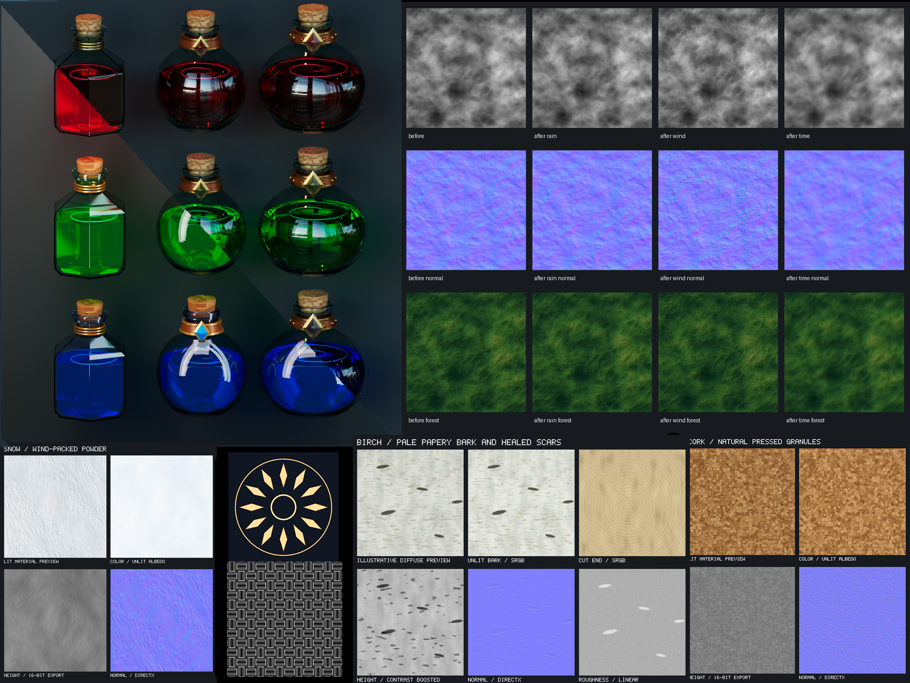

# TexUtil

Generate textures from small JSON graphs. C++17, CPU SIMD noise, parallel image
operations, floating-point intermediates, and a command line designed for agents.



Explore the [sample graphs](samples/README.md) to generate your own materials.

[Model tools and previews](docs/MODELS.md) support static OBJ, FBX, glTF and GLB:
check UVs, unwrap with xatlas, and bake curvature, AO, thickness and material-ID
maps for use in graphs. The optional Filament renderer previews materials under
studio, outdoor or custom HDR lighting, with object rotation, multiple views and
UV or triplanar projection. See [the preview recipe](samples/models/preview.json)
and [triplanar recipe](samples/models/triplanar.json). GPU preview setup is separate
from the CPU build below.

[ExportBake](docs/EXPORT_BAKE.md) bakes UV or triplanar material recipes into color,
roughness, metalness, height and normal textures for the model, with per-material
MaterialX exports. It runs on the CPU; see [the sample](samples/models/export-bake.json).

## Build on macOS

Install Apple Command Line Tools and [Homebrew](https://brew.sh), then install the
build dependencies. CMake 3.24 or newer is required. The Command Line Tools supply
the C++ compiler and Git.

```sh
xcode-select --install
brew install cmake ninja libpng
cmake -S . -B build -G Ninja -DCMAKE_BUILD_TYPE=Release
cmake --build build -j 8
ctest --test-dir build --output-on-failure
```

Run the CMake commands from the TexUtil repository root. The executable is
`build/texutil`.

## Build on Windows

Install **Visual Studio 2022** or **Build Tools for Visual Studio 2022** with the
**Desktop development with C++** workload, including the Windows SDK and C++ CMake
tools. Install Git for Windows as well. Use CMake 3.24 or newer.

Open **Developer PowerShell for VS 2022**. Install libpng and its zlib dependency
through [vcpkg](https://learn.microsoft.com/en-us/vcpkg/get_started/get-started-vs)
(one-time setup):

```powershell
$texutilVcpkg = Join-Path $env:LOCALAPPDATA "TexUtil-vcpkg"
git clone https://github.com/microsoft/vcpkg.git "$texutilVcpkg"
& "$texutilVcpkg\bootstrap-vcpkg.bat" -disableMetrics
& "$texutilVcpkg\vcpkg.exe" install libpng:x64-windows
```

From the TexUtil repository root, configure, build and test the 64-bit Release build:

```powershell
$texutilVcpkg = Join-Path $env:LOCALAPPDATA "TexUtil-vcpkg"
cmake -S . -B build-windows -G "Visual Studio 17 2022" -A x64 "-DCMAKE_TOOLCHAIN_FILE=$texutilVcpkg/scripts/buildsystems/vcpkg.cmake" -DVCPKG_TARGET_TRIPLET=x64-windows -DCMAKE_DISABLE_FIND_PACKAGE_PkgConfig=ON
cmake --build build-windows --config Release --parallel 8
ctest --test-dir build-windows -C Release --output-on-failure
.\build-windows\Release\texutil.exe samples\stone.json --out out\stone
```

The executable is `build-windows/Release/texutil.exe`. vcpkg's CMake integration
copies the required dependency DLLs beside the executable; keep those DLLs with it
when copying the utility. The target computer also needs the matching x64 Visual
C++ runtime. See [vcpkg CMake integration](https://learn.microsoft.com/en-us/vcpkg/users/buildsystems/cmake-integration)
and [Microsoft's redistributable](https://learn.microsoft.com/en-us/cpp/windows/latest-supported-vc-redist).

## Build on Linux

Install a C++17 compiler, CMake 3.24 or newer, Ninja, Git, pkg-config and libpng
development headers using your distribution's package manager. Then run:

```sh
cmake -S . -B build -G Ninja -DCMAKE_BUILD_TYPE=Release
cmake --build build --parallel 8
ctest --test-dir build --output-on-failure
```

On all platforms, the first configure downloads pinned FastNoise2 1.1.1,
nlohmann/json 3.12.0 and the model dependencies in
[third-party notices](docs/THIRD_PARTY.md). FastNoise2 also fetches a pinned FastSIMD
revision. Subsequent
builds reuse the build cache. Use separate build directories for different platforms
and toolchains. Texture generation and MaterialX export require no GUI or GPU.

Build and test validation currently covers macOS ARM64. Windows and Linux validation
is pending.

## Run

```sh
./build/texutil examples/stone.json --out out/stone
./build/texutil examples/ornament.json --out out/ornament --size 1024
./build/texutil examples/tiles.json --out out/tiles --stats
./build/texutil examples/wood.json --out out/wood
./build/texutil validate examples/stone.json
./build/texutil nodes
./build/texutil describe radial
```

`render` is optional: `texutil render material.json` and `texutil material.json` are
identical. `--help` prints usage, `--version` prints the version. Pass `-` instead of
a filename to read stdin. Image input paths are relative to the document, or the
current working directory for stdin. Outputs are relative to `--out` (default `.`).
Existing output files are overwritten. Parent directories are created automatically.
Each file is written independently; a failure can leave earlier outputs or a partial
file. Output paths that would overwrite an imported image are rejected.

| Option | Meaning |
| --- | --- |
| `--out DIR` | Output directory. |
| `--size N` or `--size WxH` | Override document size, for example `2048` or `1024x512`. |
| `--seed N` | Override document seed; explicit per-node seeds still win. |
| `--threads N` | 1..256 workers; default is CPU concurrency capped at 16. |
| `--memory MB` | Float-buffer budget, default 1024 MiB. |
| `--stats` | Per-node milliseconds on stderr. |
| `--json` | Machine-readable result on stdout; supported by render, validate, nodes. |

Successful commands exit 0; invalid input, rendering and I/O failures exit 1 with a
message on stderr. Render normally prints generated paths on stdout and a timing
summary on stderr. `describe OP` always emits JSON. CLI options use separate tokens,
not `--option=value`. Node settings stay in the graph.

## Small JSON graph

```json
{
  "size": 512,
  "seed": 42,
  "tile": true,
  "nodes": {
    "cells": {"op": "voronoi", "scale": 8},
    "clouds": {"op": "clouds", "scale": 4},
    "height": {"op": "blend", "a": "cells", "b": "clouds", "mode": "multiply", "opacity": 0.8},
    "normal": {"op": "normal", "input": "height", "strength": 0.03, "convention": "directx"}
  },
  "outputs": {
    "height.png": {"node": "height", "bits": 16},
    "normal.png": "normal"
  }
}
```

A node is a named object with an `op` and its parameters. Inputs reference other
node names. Names and object order do not control execution. There are no connection
objects, IDs separate from names, editor positions, or nested parameter wrappers.
A shared node is computed once even when several nodes/outputs reference it.

Document fields:

| Field | Default | Meaning |
| --- | --- | --- |
| `version` | `1` | Document format version. |
| `size` | `512` | Square size or `[width,height]`; dimensions 1..16384. |
| `seed` | `42` | Signed 32-bit seed. |
| `tile` | `false` | Default periodic sampling for noise nodes. |
| `background` | `"#000000"` | Opaque color used when flattening color outputs. |
| `alpha` | `false` | Preserve output alpha; requires PNG. |
| `format` | `"png"` | Encoder for output names with no extension. |
| `bits` | `8` (`32` for PFM default format) | Default integer output depth. |
| `srgb` | `true` | Encode color outputs as sRGB; data outputs ignore this. |
| `imports` | `{}` | Aliases mapped to JSON filenames; use imported nodes as `alias.node`. |
| `nodes` | required unless imports supply nodes | Named node objects, maximum 4096 after imports and preset expansion. |
| `outputs` | required | Filenames mapped to node names or output settings, maximum 1024. |

Output settings can override `node`, `format`, `bits`, `alpha`, `srgb`. A filename
extension selects its encoder; an explicit format must agree. Extensionless names
get the format appended. Paths must be relative and cannot contain `..`.

Supported exports: PNG (8/16 bit, scalar/RGB/alpha), PPM (8/16 RGB), PGM (8/16 gray),
and PFM (32-bit float, linear gray/RGB, no alpha). PFM keeps out-of-range values;
integer outputs clamp to 0..1 at export. PNG compression level is fixed at 3 for
speed. PNG is the only import format in v0.1. 16-bit PNG imports preserve precision.

## Coordinates, data and color

Coordinates use UV units: `[0,0]` is top-left, `[1,1]` bottom-right. Samples are at
pixel centers. Positive angles rotate clockwise. Width and height are independent
UV axes, so a UV circle becomes an ellipse in a rectangular image. `scale` on noise
means approximate frequency across the image; larger values give smaller features.
Transform scale enlarges the source. Stamp size is its full footprint in UV units.
Blur radius is in pixels. Normal strength is height per unit UV, independent of
resolution, so small values such as 0.02..0.08 are useful for textured surfaces.

Scalar fields use one float per pixel. Color and normal/packed data use four.
Scalar-to-RGB promotion repeats the scalar in RGB with alpha 1. Operators needing
one number use linear Rec.709 luminance. Grayscale and ramp discard source alpha;
ramps can introduce their own alpha through stop colors.

Hex colors (`#RRGGBB` / `#RRGGBBAA`) are interpreted as sRGB and converted to linear
RGB. Numeric colors (`[r,g,b]` or `[r,g,b,a]`) are already linear; a number creates a
scalar. Blends and ramps work in linear RGB. Alpha is always linear coverage.
Image nodes decode color PNGs as sRGB by default, regardless of embedded profiles;
set `srgb:false` for already-linear pixels. ICC/profile conversion is not supported.
Normal, height, mask and packed data bypass sRGB conversion. Normal/packed images
are tagged internally as data; downstream generic transforms do not rotate or
renormalize vectors. Generate normals after changing a heightfield's geometry.

For opaque inputs, multiply at 80% is `a + 0.8 * (a*b - a)`. `mask` multiplies the
opacity. Color blend modes use source-over alpha compositing with the mode applied
to overlapping colors; `mix` interpolates premultiplied RGBA. Scalar modes interpolate
between `a` and the mode result. `over` and `mix` are equivalent for scalar inputs.
Filtering uses premultiplied alpha for color to avoid black fringes.

Normals use central height differences in UV units. Red encodes `-dH/du`; DirectX
green encodes `+dH/dv` where image v increases downward. OpenGL flips green. Blue is
positive Z. Flat height produces `(0.5,0.5,1)`. Verify the convention against your
engine's importer if it flips the green channel itself.

## Tiling and placement

Noise `tile:true` maps coordinates onto a 4D torus and samples FastNoise2 in SIMD
batches across workers; this is periodic generation,
not blending opposite borders. Tileable noise differs from non-tileable noise with
the same seed. Adjacent first/last pixel values need not be identical: their centers
are one pixel apart across the seam. Spatial operations support `repeat`, `clamp`,
and `transparent` sampling. These edge rules do not make nonperiodic inputs seamless.

`array` places source stamps on a grid; `radial` places them around a circle; `stamp`
accepts explicit positions with per-placement size, angle and opacity overrides.
They start with zero for scalar fields or transparency for color. Use a separate
blend to place them over a background. Default overlap mode is `max`; `over` is useful
for colored stamps. `wrap:true` wraps footprints across the output edges. Rotated
wrapped stamps may overlap their own copies. Arrays do not automatically resize
stamps to fit their cells; set `size` explicitly.

```json
{
  "nodes": {
    "dot": {"op": "shape", "type": "circle", "softness": 0.2},
    "ring": {"op": "radial", "input": "dot", "count": 16, "radius": 0.35, "size": 0.08},
    "color": {"op": "ramp", "input": "ring", "stops": [[0,"#141820"],[0.4,"#735231"],[1,"#ffe5a0"]]}
  },
  "outputs": {"ornament.png":"color"}
}
```

See [the node reference](docs/NODES.md) for every field, default and allowed value,
and [the execution plan](docs/PLAN.md) for architectural boundaries. The executable
currently supports 47 operations and 18 built-in preset recipes. [Validation and benchmarks](docs/VALIDATION.md)
record correctness checks, measured timings and visual review.

## Directional warp and wood

`directional_warp` bends a source along a chosen angle, optionally driven by a B/W
image or selected channel. `stripes` supplies antialiased periodic lines. The
[wood recipe](docs/WOOD.md) explains how these combine with shapes, stamps and noise
to create knotted grain. `examples/wood.json` exports color, height, normal and
roughness maps.

## Presets and erosion

```json
{
  "size": 512,
  "tile": true,
  "nodes": {
    "base": {"op": "preset", "name": "brick", "config": {"scale": 1, "detail": 0.7, "seed": 42}},
    "worn": {"op": "erode", "input": "base", "mode": "time", "iterations": 32},
    "normal": {"op": "normal", "input": "worn", "strength": 0.02}
  },
  "outputs": {"height.png": {"node": "worn", "bits": 16}, "normal.png": "normal"}
}
```

`texutil presets` lists recipes; `texutil presets --json` returns a JSON array.
[Presets](docs/PRESETS.md) describes each recipe and its `config` object.
[Advanced nodes](docs/ADVANCED.md) covers distance/bevel, filters, math,
noise-domain anisotropy and sampling maps. [Erosion](docs/EROSION.md) explains wind,
rain and time controls, conservation, boundary behavior and simulation limits.

Render all new features, all presets and an erosion comparison with:

```sh
python3 tools/gallery.py
```

This optional Python batching helper invokes TexUtil to save individual PNGs and native labeled sheets
under `out/nodes-gallery/`, `out/presets-gallery/`, `out/erosion/`,
`out/effects-gallery/`, `out/forest/`, and `out/snow/`. No Pillow is required. Erosion also
exports unclipped float PFM heights. Every graph is checked in under `examples/`;
the C++ tool can render them directly without Python.

## Labeled sheets and snow

Outputs can combine multiple nodes into a native labeled graphic:

```json
"preview.png": {
  "type":"sheet", "title":"Material maps", "columns":3, "cell":320,
  "items":[
    {"node":"color","label":"Color"},
    {"node":"height","label":"Height"},
    {"node":"normal","label":"Normal"}
  ]
}
```

Put this object inside `outputs` alongside individual map exports. Nodes can appear
in several cells or sheets without recomputation. [Sheet outputs](docs/SHEETS.md)
describes layout, text, color/data display, memory use and validation.

[Snow](docs/SNOW.md) provides a tileable 2048-square material with color, 16-bit height,
float height, DirectX normals, a lighting preview and a native contact sheet:

```sh
./build/texutil samples/snow.json --out out/snow
```

## Reuse JSON recipes

Use named imports to combine existing graphs without copying their nodes or rendering
intermediate images:

```json
"imports": {
  "glass": "glass.json",
  "dust": "dust.json",
  "prints": "fingerprints-scattered.json"
}
```

Then use references such as `glass.roughness`, `dust.dust` and
`prints.scattered-prints` in ordinary nodes. See [graph imports](docs/IMPORTS.md)
for scope, seed, size and path rules. The complete example is runnable:

```sh
./build/texutil samples/handled-glass.json --out out/handled-glass
```

## MaterialX materials

Stone, wood, snow, cork, glass and potion samples also export `.mtlx` materials with
their PNG maps connected. [MaterialX export](docs/MATERIALX.md) supports all 42
Standard Surface inputs, including colors, IOR, transmission, coat, subsurface and
emission. Values can be constants or exported texture bindings. Relative paths,
color spaces, DirectX normal conversion and optional displacement are handled for you.

```sh
./build/texutil samples/potion.json --out out/potion
./build/texutil materialx --json
```

Copy the `.mtlx` and referenced PNGs together for use in Maya LookdevX or another
compatible host. Exporting adds no GPU, Python or MaterialX runtime dependency.

## Effects, regions and conversion

[Effects](docs/EFFECTS.md) covers `glow`, `stroke`, `edge_detect`, `swirl`, and `polar`.
[Field operations](docs/FIELDS.md) covers `flood_fill`, existing height-to-normal
(`normal`), and least-squares `normal_to_height` reconstruction.

The [forest example](docs/FOREST.md) demonstrates stronger cumulative rain, wind
and thermal settling, with a lush green palette and separate unlit albedo.
[Portable samples](samples/README.md) contains 20 check-in-ready JSON graphs,
including actual `terrain.json` and `forest.json` files:

```sh
./build/texutil samples/terrain.json --out out/terrain
python3 tools/gallery.py --only forest --size 1024
python3 tools/gallery.py --only effects-gallery
```

The executable generates pixels using FastNoise2 SIMD noise plus TexUtil's own
C++ algorithms operating on float buffers. libpng encodes PNG files. TexUtil's
exporters write PPM/PGM and float PFM directly. No image-generation service, browser,
Python runtime or GPU is involved in texture generation.

## Performance and limits

Only reachable nodes execute. The evaluator uses a topological schedule, keeps each
result immutable, exports it when available, and releases buffers after their last
consumer. Noise and its fractal run together inside FastNoise2 SIMD; the whole JSON
graph is not fused. Noise and image operations use a persistent row worker pool.
Export is serial. Stamps use bounds and row
bands rather than searching all stamps at each pixel. Box blur uses sliding sums,
so per-pixel work does not grow with radius (initial row/column sums still do).

The memory budget tracks live float images, blur/solver intermediates, and flood-fill
index buffers. PNG decode
also checks temporary raw storage against available budget. It is not a hard process
RSS cap: codecs, thread stacks, row buffers and JSON have additional overhead.
Graphs exceeding the image-buffer budget fail with a useful error. Stamps/arrays
are limited to 10000 placements and 4 million row-band references. Noise supports
up to 12 octaves, with effective frequency including stretch capped at 10 million.
Gaussian blur costs O(pixels × sigma); line/slope blur costs O(pixels × samples).
Distance/bevel use linear-time separable distance transforms. Erosion costs
O(pixels × iterations), up to 512 steps; all full-image working buffers count
toward the memory limit. Blue-noise point selection costs O(candidates × count²). Very large stamp footprints/counts can still be expensive.

Validation checks fields, ranges, references, cycles (including unused nodes),
output settings and input file existence. PNG contents and actual memory needs are
checked at render time. Deterministic thread-count behavior is tested; exact output
identity across platforms/compiler versions is not guaranteed. FastNoise2 strict
floating-point mode is enabled.

## Large heightfields

Maximum dimensions are 16384 × 16384 (about 268 million pixels). Internal heights
are 32-bit float; export PNG at 16 bits or PFM at 32 bits for height precision.
Increasing resolution adds samples, so tune noise frequency/octaves for added detail.
Pixel-based filters and erosion distances change their footprint with resolution.

`--memory` defaults to 1024 MiB as an accidental-allocation guardrail. It is neither
a precision limit nor a reservation of physical RAM. Raise it explicitly only when
the machine has sufficient available memory and additional process headroom:

```sh
./build/texutil samples/terrain.json --size 16384 --memory 24576 --out out/terrain
```

| At 16384 square | Approximate tracked buffer memory |
| --- | --- |
| One scalar heightfield | 1 GiB |
| Scalar input plus scalar output | 2 GiB |
| Scalar height plus RGBA normal | 5 GiB |
| Rain erosion input and scratch buffers | 11 GiB |
| Normal integration input and scratch/output buffers | 10 GiB |

Other live graph inputs add to these numbers. The engine holds full images in RAM;
there is no out-of-core tile executor. Large iterative erosion/integration can be
expensive. The 16K dimension is supported by the code limits, but no complete 16K
render was run during this feature pass. The generated forest example is 1024 square.

## Dependencies

- FastNoise2 1.1.1: MIT, fetched by immutable commit.
- FastSIMD: MIT, revision pinned by FastNoise2.
- nlohmann/json 3.12.0: MIT, archive verified by SHA-256.
- libpng: platform library; libpng license, with zlib dependency.

Their license texts remain in the fetched sources or installed packages. See
[third-party notices](docs/THIRD_PARTY.md). TexUtil itself uses the [MIT license](LICENSE).
