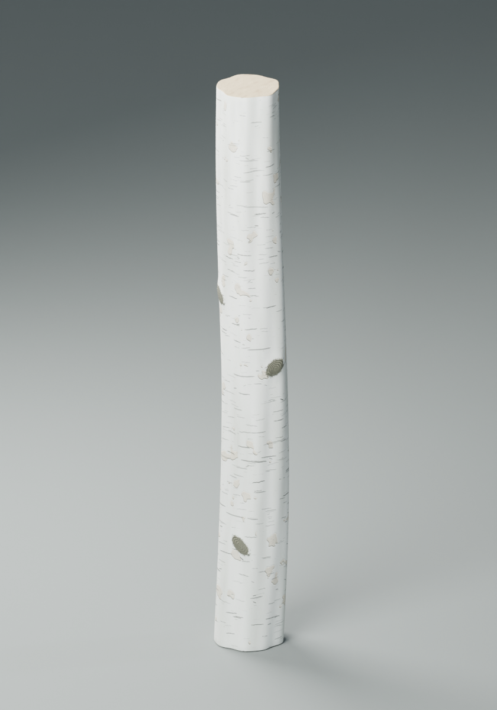
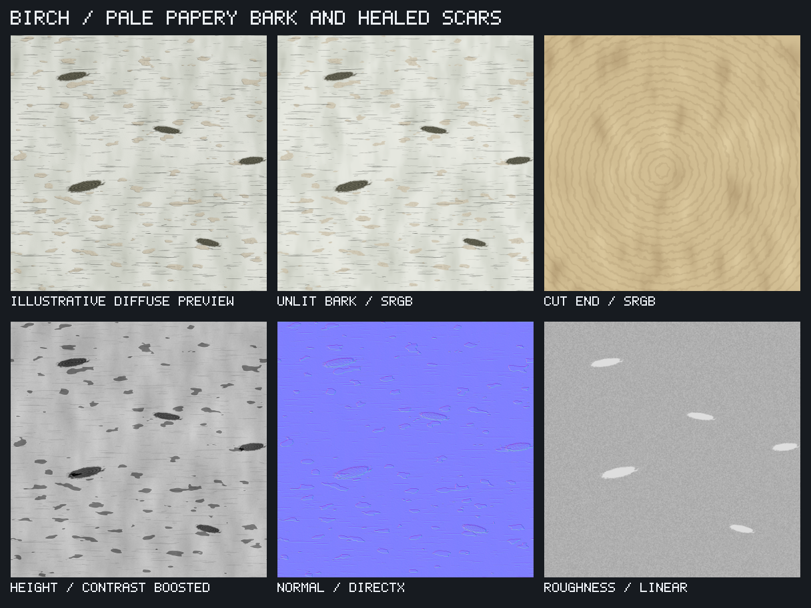

# Birch log material

[samples/birch.json](../samples/birch.json) approximates the user's birch reference
with pale papery bark, horizontal lenticels, warm exposed patches and five healed
branch scars. It describes one log's bark, with separate maps for a cut end. All
texture pixels come from TexUtil nodes; the reference photograph is not embedded
or projected into the material. [examples/birch.json](../examples/birch.json) is the
matching portable copy.



## Generate maps

```sh
./build/texutil validate samples/birch.json
./build/texutil samples/birch.json --out out/birch --threads 8
```

The saved resolution is 2048 square. U wraps once around the trunk and V follows
its length. The preview uses a roughly 9 cm diameter, 78 cm long log, so the square
image is intentionally stretched vertically on its cylindrical UVs. The bark
repeats in both axes; the radial end grain is for a cap and is not tileable.

| Output | Use |
| --- | --- |
| `birch-color.png` | Unlit sRGB bark color. |
| `birch-height.png` / `.pfm` | Shallow bark relief as 16-bit linear PNG / float PFM. |
| `birch-normal.png` | DirectX tangent-space normal, 16-bit linear. |
| `birch-roughness.png` | Linear roughness, 16-bit; rougher branch scars. |
| `birch-profile.png` | Separate smooth mask for broad swelling around healed scars; used by the optional preview mesh. |
| `birch-end-color.png` / `birch-end-normal.png` | Cut-end sRGB color and linear DirectX normal. |
| `birch.mtlx` | Portable MaterialX 1.38 bark material, `BirchBark`. |
| `birch-arnold.mtlx` | MaterialX 1.39 bark with absolute texture paths for Maya's `aiMaterialXShader`; select `BirchBark`. |
| `birch-end.mtlx` | Portable cut-end material, `BirchEnd`. |
| `birch-lit.png` / `birch-sheet.png` | Illustrative diffuse view / native labeled map sheet. |

Both materials use metalness 0 and IOR 1.5. Height is exported separately; the
MaterialX surface uses normals without automatic displacement. The preview's
coarse scar swelling is separate from the normal detail. For other meshes, tune
normal strength and displacement for the actual UV proportions and scene units.
Regenerate the absolute-path Arnold export if the output directory moves.

## Optional single-log render

```sh
blender --background --factory-startup --python tools/render_birch.py -- --out out/birch
```

On macOS, the tested executable is
`/Applications/Blender.app/Contents/MacOS/Blender`. This optional script requires
Blender, but map generation does not. It creates one closed, slightly irregular
log with separate bark and cap materials, a neutral floor, two area lights and
Blender's bundled `studio.exr` environment. Supply `--hdr /path/to/environment.exr`
to use another HDRI. It writes `birch-log.png` and `birch-log.blend` under `--out`.
Run it in a separate background process as shown; it clears that process's scene.

The Blender scene references the generated maps and HDR by absolute paths. Keep
those assets available, or pack resources in Blender before moving the scene.
The HDR is not copied into the repository. The preview approximates surface
peeling through relief; it does not model separate hanging bark strips or branch
stubs. It is a material study rather than a scan of an individual photographed log.

## Controls and checks

- `paper-white.stops` controls the chalky gray/ivory palette.
- `lenticels-raw`, `long-slits` and `small-chips` control horizontal mark density,
  size and opacity. Their explicit seeds keep placement reproducible.
- `peeling.range` controls exposed papery patches; `peel-depth` and `curl-height`
  control shallow relief at those patches.
- Keep `scars.points` and `scar-mask.points` synchronized when moving branch scars.
- `roughness-base.out` controls the intact finish; `rough-scar.value` sets scars.
- End grain is generated independently from a warped radial field. Tune
  `end-ring-scale.value` and `end-ring-color` for growth rings.

The portable sample test passed, and MaterialX SDK 1.39.4 validated all three
documents, texture paths and GLSL generation. The 2048 height range is about
0.37186..0.53500; roughness is 0.60049..0.86999. A 2x2 bark repeat was visually
inspected. Mean height seam differences are 0.77 times ordinary neighboring
differences in U and 0.61 in V. Large scars remain recognizable when repeated.
Blender 5.1.2 rendered the supplied single-log preview with Cycles CPU, 96 samples,
denoising, the studio HDR at strength 0.45, AgX and exposure 0. These checks do not
claim that this birch material was rendered in Maya.


