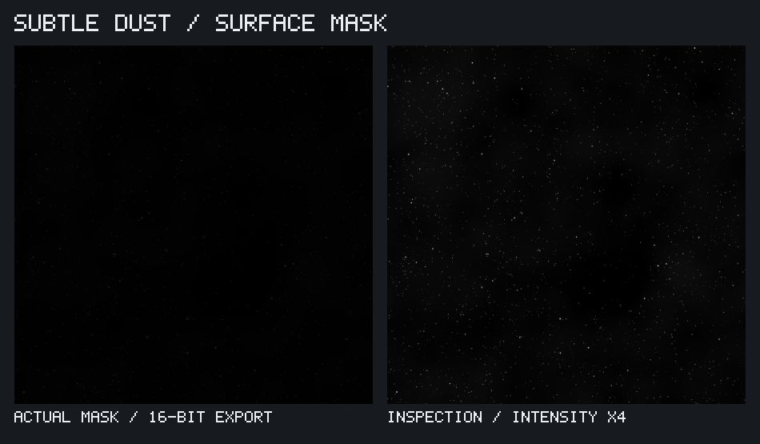

# Subtle dust mask

[samples/dust.json](../samples/dust.json) generates a tileable 2048-square grayscale
dust mask using existing nodes. A matching graph lives in
[examples/dust.json](../examples/dust.json).

```sh
./build/texutil samples/dust.json --out out/dust
```

| Output | Purpose |
| --- | --- |
| `dust-mask.png` | Actual 16-bit linear mask, with light dust on black. |
| `dust-inverted.png` | Inverse mask, dark dust on white, in 8-bit grayscale. |
| `dust-inspection.png` | Four-times intensity for inspecting small particles; values above 1 clip. |
| `dust-sheet.png` | Native labeled comparison of the actual and boosted masks. |



Gaussian stamps create fine particles and occasional larger flecks. A few narrow
capsule stamps add lint. Periodic cloud noise varies particle density and contributes
a faint haze, capped at 0.012. Screen blending accumulates these layers. All scatter
nodes wrap across image boundaries.

Use `dust-mask.png` as linear data to blend dusty color or roughness over another
material. Its low values are intentional; it is not normalized to fill the black-to-
white range. The sheet's right-hand image and `dust-inspection.png` are boosted
inspection views, not the intended material strength.

- `fine-dust.count` (4200) and `flecks.count` (210) set candidate particle counts;
  the density mask rejects some placements.
- Their `size`, `size_jitter` and `value_range` control diameter, variation and
  individual intensity. Fine grain intensity is 0.035 to 0.20; flecks use 0.06 to 0.28.
- `lint.count` (30) controls occasional short fibres.
- `haze.out[1]` controls the faint background buildup. Set it to zero to omit haze.
- Change each scatter seed for new placements. The source noises also have explicit
  seeds for reproducibility.

The texture is tuned for 2048 pixels. Lower resolutions or small thumbnails can
hide the finest particles. The checked-in guide image is a copy of the native
`dust-sheet.png` output generated at the saved resolution.
