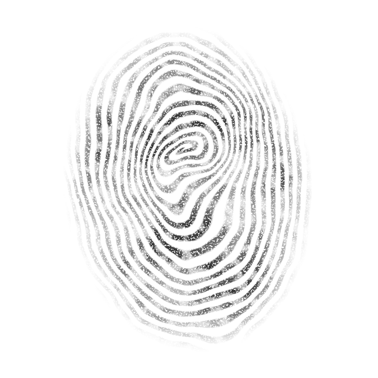
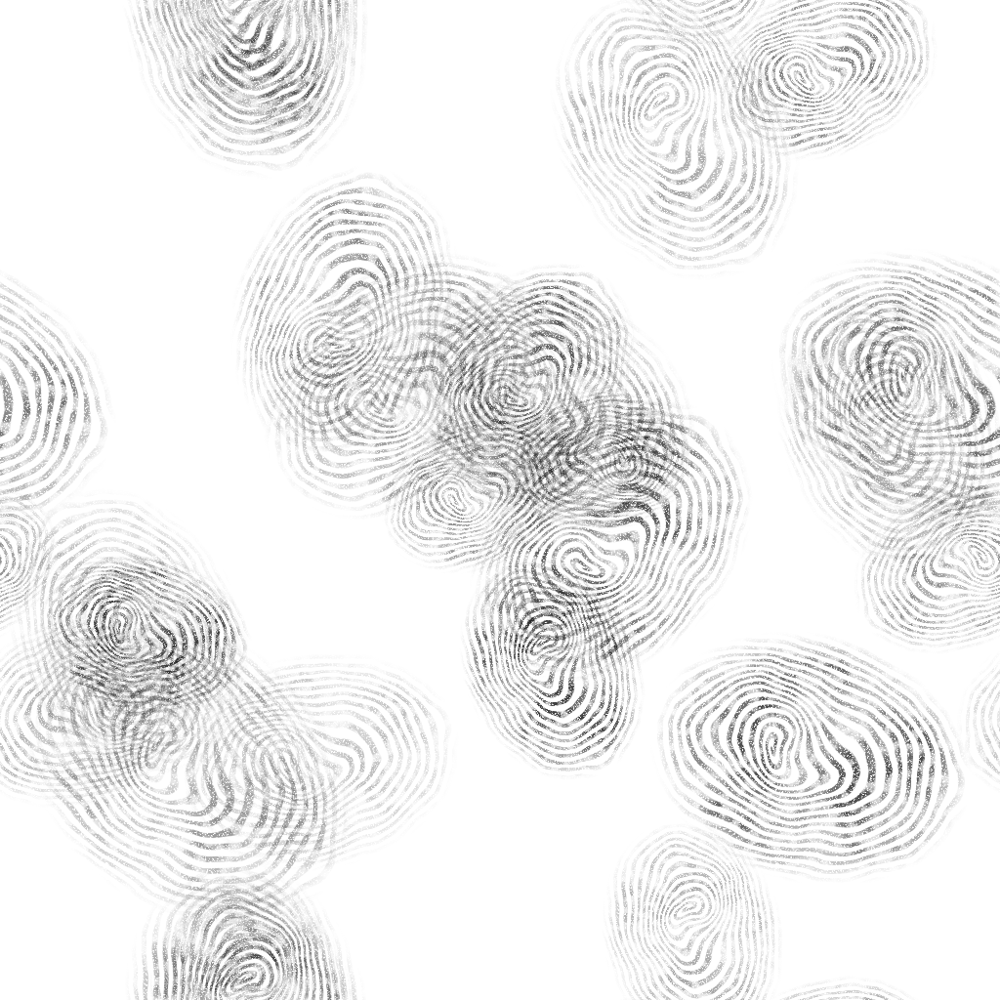

# Procedural fingerprint-style mask

[samples/fingerprint.json](../samples/fingerprint.json) builds a stylized fingerprint
using existing TexUtil nodes. It needs no source images. The matching example is
[examples/fingerprint.json](../examples/fingerprint.json).



```sh
./build/texutil samples/fingerprint.json --out out/fingerprint
```

The two outputs are 2048-square, 8-bit grayscale PNGs:

- `fingerprint-mask.png`: white ridges on black, useful for stamping or controlling
  roughness, opacity and other material inputs.
- `fingerprint-ink.png`: the inverse, black ridges on white for guide illustrations.

## Construction

1. Combine a radial gradient multiplied by 34 with an angular gradient to create
   the phase of a spiral.
2. Take its fractional part, subtract 0.5 and use absolute value plus levels to
   create repeating ridges.
3. Stretch and rotate the pattern into an oval, then twist its core with `swirl`.
4. Use two low-frequency cloud fields to warp the ridge flow slightly.
5. Multiply by a broadly feathered oval contact mask and faded pressure, then add
   patchy grunge and fine missing-ink speckles. Invert for the ink-on-paper output.

`rings.value` sets ridge density. `ridges.in` controls ridge width and feathering.
`core-loop.angle` changes the core twist, while `ridge-flow.strength` changes its
irregularity. `pressure.out` sets overall ink intensity (currently 0.28 to 0.78),
and `fingertip.softness` controls the edge fade (currently 0.3). Increase
`worn-contact.opacity` for stronger patchy grunge, or raise `ink-retention.in` for
more fine missing ink. Export `print-ridges` to omit the fine speckles while keeping
the patchy fade. Explicit noise seeds keep
the sample reproducible and can be edited for variations.

The image is an isolated print with an empty border, intended to be placed using
`stamp`, `array` or `scatter`. It is a stylized whorl pattern, not an anatomical
simulation. All outputs are scalar data; there is no transparent alpha channel.

The checked-in guide illustration was rendered at 768 pixels:

```sh
./build/texutil samples/fingerprint.json --size 768 --out out/fingerprint-guide
```

Its `fingerprint-ink.png` is copied to `docs/images/fingerprint-example.png`.
Render at the intended size to retain narrow ridge detail.

## Scattered fingerprints

[samples/fingerprints-scattered.json](../samples/fingerprints-scattered.json) includes
the same fingerprint construction and adds a `scatter` node. It generates 22 prints
with varying size, rotation and intensity. The original single-print sample remains
available separately.

```json
"scattered-prints": {
  "op": "scatter",
  "input": "fingerprint",
  "count": 22,
  "size": 0.32,
  "size_jitter": 0.3,
  "rotation_jitter": 180,
  "value_range": [0.18, 1],
  "mode": "screen",
  "wrap": true,
  "seed": 3851
}
```

`value_range` multiplies each scalar stamp's ink intensity, giving the appearance
of varying opacity. These factors multiply the already-faded source fingerprint;
they are not absolute output values. `screen` combines white-on-black ridges without
erasing earlier prints, and inversion produces the black-on-white version. `wrap`
continues edge-crossing prints on the opposite side of the output. The source stamp
does not need to be seamless for this to work.

```sh
./build/texutil samples/fingerprints-scattered.json --out out/fingerprints-scattered
```

Outputs are `fingerprints-mask.png` (white on black) and `fingerprints-ink.png`
(black on white), both 2048-square grayscale PNGs. Edit the scatter seed to change
placement without changing the fingerprint's explicitly seeded internal pattern.



The guide image above is the ink output rendered with `--size 1024` and copied into
`docs/images/fingerprints-scattered.png`.
