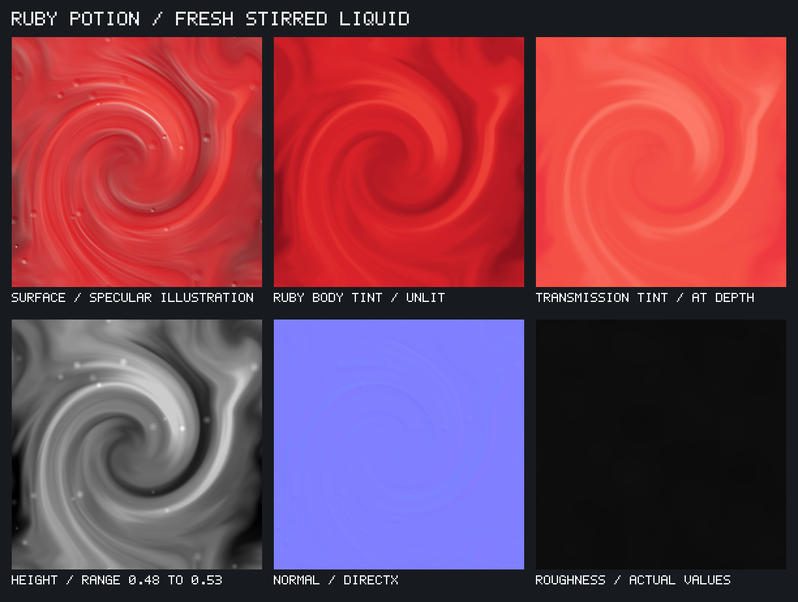

# Ruby health potion brew

[samples/potion.json](../samples/potion.json) produces a stylized 2048-square
freshly stirred red liquid, with restrained surface relief and a separate
transmission tint. Its matching example is [examples/potion.json](../examples/potion.json).
It uses native nodes and needs no imported images.



```sh
./build/texutil validate samples/potion.json
./build/texutil samples/potion.json --out out/potion --threads 8
```

## Construction and material choices

The recipe starts with a scalar heightfield. Stretched fractal noise is warped by
two independent flow fields, then twisted into a broad eddy and a smaller eddy
crossing a tile corner. Three low-gain octaves retain flowing forms without fine,
gritty detail. Twenty-two wrapped Gaussian stamps add small surface bubble domes.
Normals are derived from the completed height with strength 0.04 and repeat edges.

Roughness uses a separate low-frequency field remapped into 0.035..0.065, suitable
as a starting point for a smooth liquid surface. It does not duplicate the height
contrast. This is a fresh liquid, so dust, scratches and fingerprints belong to a
separate bottle material rather than these liquid maps.

Color comes last. A smooth `ramp` produces crimson variation without the original
near-black bands. A second ramp supplies transmission color at a chosen absorption
distance. These are artistic tint variations, not baked reflections or shadows.
The body-color map remains useful for previews or a more opaque variation; the
default fully transmissive material gets its visible tint from transmission.

The material uses constant metalness 0, IOR 1.33, transmission 1, base weight 0 and
`thin_walled:false`. Emission is disabled by default; its optional texture is still
exported and connected. Displacement is not bound by default, avoiding duplicate
relief from full-strength displacement plus the same normal map.

## Outputs

| Output | Purpose |
| --- | --- |
| `potion.mtlx` | MaterialX 1.38 Standard Surface liquid for compatible hosts such as Maya 2026. |
| `potion-1.39.mtlx` | The same material in 1.39 format for Maya 2027 / LookdevX 2.0; see [MaterialX export](MATERIALX.md). |
| `potion-arnold.mtlx` | MaterialX 1.39 with absolute texture paths for Maya 2027 Hypershade's `aiMaterialXShader`; select material `Potion`. Regenerate after moving the output folder. |
| `potion-color.png` | Unlit sRGB ruby body tint, without specular lighting. |
| `potion-transmission-color.png` | 16-bit sRGB transmission tint, separate from body color. |
| `potion-height.png` | 16-bit linear shallow ripples and small bubble domes. |
| `potion-height.pfm` | The same heightfield as 32-bit float. |
| `potion-normal.png` | 16-bit DirectX tangent-space normals. |
| `potion-roughness.png` | 16-bit linear, low and gently varying roughness. |
| `potion-transmission.png` | Constant white transmission mask for manual hookups; the material uses the equivalent constant 1. |
| `potion-emission.png` | Optional faint ribbon emission color, stored as 16-bit sRGB. |
| `potion-bubbles.png` | Linear surface bubble mask for custom shader effects. |
| `potion-preview.png` | A 2D specular illustration driven by height-derived normals and roughness. |
| `potion-sheet.png` | Native six-panel illustration, body tint, transmission tint, boosted height, normal and actual roughness. |

The material maps use periodic noise, wrapped swirls/stamps and repeat sampling.
The repeated pattern is recognizable; seamless edges do not hide repetition.
Height varies around 0.5. Only `height-inspection` expands the contrast for display;
it is not a displacement source. The almost-black roughness panel shows actual
linear values and is expected for this smooth surface.

The preview uses a normalized half-vector dot product and a roughness-controlled
specular exponent. Its constants compensate for the grayscale node's Rec.709
weights to form that dot product. It is an artistic surface illustration, not an
energy-conserving BRDF, glass bottle render or refraction simulation. Bubble accents
come from the same normals as the ripples; there are no separately drawn ring
highlights. Specular lighting is not connected to any material texture input.

## Using it inside a bottle

Apply the material to separate, closed liquid geometry inside a glass container.
The IOR 1.33 is a water-like starting assumption, not a measurement of a fantasy
potion. Keep color/emission/transmission tint tagged as sRGB and height, normal,
roughness and masks as raw linear data. The MaterialX normal helper converts the
DirectX green convention for its standard tangent-space decoder.

`transmission_depth:0.15` defines the tint's reference distance in scene units.
Scale it to the actual liquid thickness: a smaller distance generally produces
stronger absorption for a fixed path length. Bottle geometry, nested dielectric
handling, lighting and renderer support determine the final appearance. The tint
map is not a 3D simulation of ingredients mixing inside the liquid. Floating
interior bubbles require geometry or an appropriate volume effect; these domes
represent only surface agitation.

For magical emission, raise `inputs.emission` from 0 in the MaterialX output you use.
Keep all material declarations synchronized when adjusting the recipe.
The connected emission texture already limits the effect to faint flow ribbons.
To enable geometric displacement, add a `displacement` helper with
`texture:"potion-height.png"`, `midlevel:0.5` and a scene-appropriate `scale`.
For a one-unit-wide tile, 0.04 matches the baked normal height scale, but reduce or
separate the overlapping normal detail if displacing the same features. Use a
smoother displacement branch when only broad silhouette motion is needed.

## Controls

- `main-swirl.angle` (320) and `flow.angle` (-150) control the eddies.
- `flow-warp.strength` (0.12) changes irregular flow; `flow-base.stretch` ([1,3.2])
  controls ribbon proportions. `gain` (0.3) and `octaves` (3) govern fine structure.
- `ripple-height.out` ([0.48,0.52]) sets broad relief; `bubble-height.out[1]`
  (0.014) sets dome height before the stamp's intensity modulation.
- `bubbles.count` (22), `size` (0.032), `size_jitter` (0.6), `value_range`
  ([0.4,0.85]) and `seed` (349) control bubble placement and scale.
- `finish-variation` and `roughness.out` control the surface finish independently
  of pigment flow. The output interval is an envelope, not a guaranteed min/max.
- `color.stops` controls body tint; `transmission-color.stops` and the material's
  `transmission_depth` control transmitted color. Do not darken body color to fake
  absorption or copy preview highlights into either ramp.
- `silk-ribbons.range` and `emission-mask.out[1]` control the optional glow mask.

Explicit node seeds preserve reproducibility. The recipes and this guide are
check-in-ready; generated materials live in ignored `out/potion/`. The documented
sheet is intentionally copied to `docs/images/potion-example.png`.
